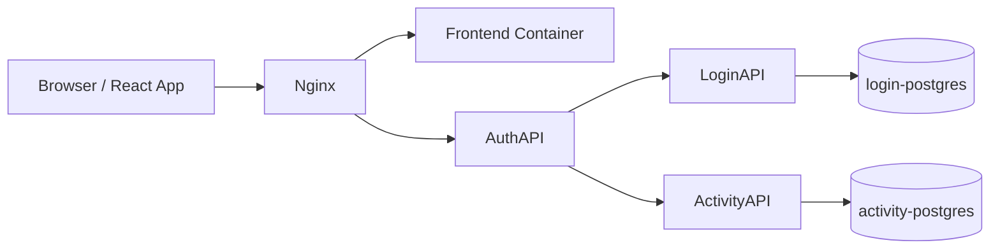

# Login Platform (Assessment Project)

End-to-end authentication platform with:

- React frontend (`login-app`)
- Auth gateway API (`AuthAPI`)
- Core identity API (`LoginAPI`)
- Activity/audit API (`ActivityAPI`)
- PostgreSQL persistence (two DBs)
- Nginx edge routing

---

## 1) What this project demonstrates

### Core scope

- Register, login, and profile flows
- Protected routes in the frontend
- Role-aware behavior (`User`, `Admin`)
- JWT-based authentication with token refresh envelope
- Password hashing using BCrypt
- Service-to-service protection using internal API key
- Activity event capture (login/register/profile/logout)

### Architecture split

`AuthAPI` is the only externally exposed API through Nginx. It:

- validates bearer JWTs for clients,
- proxies calls to internal services,
- injects `X-Internal-Api-Key` for trusted downstream communication,
- and issues/refreshes JWTs returned to the frontend.

`LoginAPI` and `ActivityAPI` are internal-only services protected by internal API key policy.

The split is intentional to follow a separate microservice architecture, where each service owns a focused responsibility and can scale and deploy independently.

---

## 2) High-level architecture



### Request routing

- `/` and SPA routes -> frontend container
- `/api/*` -> `AuthAPI`
- `AuthAPI` proxies internally to:
	- `LoginAPI` for identity/user operations
	- `ActivityAPI` for activity events

---

## 3) Technology stack

### Frontend

- React 19 + TypeScript + Vite
- React Router
- Vitest + Testing Library

### Backend

- ASP.NET Core (`net10.0`)
- EF Core + Npgsql (PostgreSQL)
- FluentValidation
- AutoMapper
- JWT Bearer auth (gateway)
- BCrypt password hashing
- xUnit for unit + integration tests

### Infra / runtime

- Docker + Docker Compose
- Nginx reverse proxy
- PostgreSQL 17 (two databases)

---

## 4) Repository layout

```text
login/
├─ login-app/                 # React client
├─ AuthAPI/                   # Public auth gateway
├─ LoginAPI/                  # Internal identity service
├─ ActivityAPI/               # Internal activity/audit service
├─ tests/                     # Unit + integration test projects
├─ nginx/nginx.conf           # Edge routing config
├─ docker-compose.local.yml   # Local build-and-run stack
├─ docker-compose.yml         # Deployment stack (prebuilt images)
└─ TEST_COVERAGE.md           # Coverage matrix
```

---

## 5) Security model

### Password handling

- Passwords are hashed with BCrypt before persistence.
- Plaintext passwords are never stored.

### JWT handling

- Frontend receives JWT from `AuthAPI` login endpoint.
- Protected endpoints require `Authorization: Bearer <token>`.
- Gateway re-issues access JWTs for authenticated proxied calls and returns them in a token envelope.
- This is stateless access-token re-issuance (rolling refresh), not a separate persisted refresh-token flow.
- Frontend detects token expiry and logs out with a session-timeout dialog.

### JWT claim usage

- `userId`/`sub` identifies the caller for `/api/me` downstream lookup.
- `role` drives authorization (`AdminOnly` policy).
- `iss`/`aud`/`exp` are enforced by JWT bearer validation.
- `email`, `given_name`, and `family_name` are propagated when refreshed tokens are minted.
- `jti` is issued per token but not currently used for revocation/state tracking.

### Access token strategy

- On successful authenticated endpoints (`/api/me`, `/api/users`, `/api/activity`, `/api/activity/{count}`), `AuthAPI` returns newly issued access JWT.
- This keeps the design simple and stateless while still extending active sessions through normal authenticated traffic.

### Internal service protection

- `LoginAPI` and `ActivityAPI` require `X-Internal-Api-Key`.
- `AuthAPI` injects this key when proxying downstream.
- Internal key comparison uses constant-time equality.

### Role-based authorization

- `AdminOnly` policy in `AuthAPI` for `/api/users`.
- Login/profile responses include role claims.

### Secret management

- Use environment variables only.
- Keep all secrets in `.env` (do not hardcode secrets in source).

---

## 6) Data model overview

### Login database

- `Users` (unique email)
- `Roles` (unique role name)
- `UserRoles` (many-to-many join)

Default role assignment:

- Newly registered users receive `User` role.

Optional seed behavior:

- When demo user environment variables are provided, startup seeding creates/updates a demo admin user with `User` + `Admin` roles.

### Activity database

- `ActivityEvents` records events such as:
	- account creation
	- login
	- profile viewed
	- logout

### Database indexing

- `Users.Email` is uniquely indexed to enforce uniqueness and speed login/lookup by email.
- `Roles.Name` is uniquely indexed to ensure stable role resolution.
- `UserRoles` uses indexed foreign keys/composite key semantics for efficient user-role joins.


---

## 7) API surface

## Public endpoints (through Nginx -> AuthAPI)

| Method | Path | Auth | Description |
|---|---|---|---|
| GET | `/api/health` | No | Auth gateway health check |
| POST | `/api/register` | No | Register user (proxied to LoginAPI) |
| POST | `/api/login` | No | Login and receive JWT |
| GET | `/api/me` | Bearer | Current user profile + refreshed token envelope |
| GET | `/api/users` | Bearer + Admin | List users + refreshed token envelope |
| POST | `/api/activity` | Bearer | Create activity event |
| GET | `/api/activity/{count}` | Bearer + Admin | Fetch recent activity events |

### Response envelope shapes used by AuthAPI

Login response:

```json
{
	"token": "<jwt>",
	"user": {
		"id": 1,
		"email": "user@example.com",
		"firstName": "First",
		"lastName": "Last",
		"createdAt": "2026-03-01T00:00:00Z",
		"roles": ["User"]
	}
}
```

Re-issued access-token response envelope (for `/api/me`, `/api/users`, activity endpoints):

```json
{
	"token": "<refreshed-jwt>",
	"data": {}
}
```

### Internal-only service endpoints

`LoginAPI` (requires internal API key)

- `POST /api/auth/register`
- `POST /api/auth/login`
- `GET /api/auth/me/{userId}`
- `GET /api/auth/users/internal`

`ActivityAPI` (requires internal API key)

- `POST /api/activity`
- `GET /api/activity/{count}`

---

## 8) Frontend behavior

### Pages

- Register page with client-side validation
- Login page with validation + error handling
- Profile page (protected route)
- Admin-only sections on profile page:
	- all users table
	- recent activity list

### Route protection

- `PrivateRoute` gates `/profile`.
- Unauthenticated users are redirected to `/login`.
- Session expiry triggers a timeout modal and re-auth prompt.

---

## 9) Running locally

## Prerequisites

- Docker + Docker Compose
- (Optional for non-container runs) .NET SDK and Node.js

## Full stack with local builds

1. Configure environment variables in `.env`.
2. Start local stack:

```bash
docker compose -f docker-compose.local.yml up -d --build
```

3. Open:

- App: `http://localhost:8080`

Helper script (fresh restart):

```bash
./scripts/run-fresh-local.sh
```

What this helper does:

- Runs against `docker-compose.local.yml`.
- Executes `docker compose down --volumes --rmi local --remove-orphans`, which:
	- stops and removes all stack containers,
	- removes local-only images built for this compose project,
	- removes attached named volumes for the local stack (resetting DB state),
	- removes orphaned containers from previous compose runs.
- Starts the full local stack again with `docker compose up -d`.

Use it when you want a clean local Docker reset of services, images built locally, and persisted local volumes.

---

## 10) Environment variables

Create/update `.env` in repo root. See [.env.example](.env.example).

### Required groups

- **JWT secret** (`JwtSettings__SecretKey`)
- **Internal API key** (`INTERNAL_API_KEY`)
- **Login DB** (`POSTGRES_DB`, `POSTGRES_USER`, `POSTGRES_PASSWORD`)
- **Activity DB** (`ACTIVITY_POSTGRES_DB`, `ACTIVITY_POSTGRES_USER`, `ACTIVITY_POSTGRES_PASSWORD`)
- **Demo seed user** (`DEMO_USER_*`) if you want automatic demo/admin account creation

---

## 11) Testing

Test coverage summary is maintained in [TEST_COVERAGE.md](TEST_COVERAGE.md).

### Backend test options

Run everything in one command:

```bash
dotnet test login.sln
```

Run by API/service area:

```bash
# LoginAPI
dotnet test tests/LoginAPI.UnitTests/LoginAPI.UnitTests.csproj
dotnet test tests/LoginAPI.IntegrationTests/LoginAPI.IntegrationTests.csproj

# AuthAPI
dotnet test tests/AuthAPI.UnitTests/AuthAPI.UnitTests.csproj
dotnet test tests/AuthAPI.IntegrationTests/AuthAPI.IntegrationTests.csproj

# ActivityAPI
dotnet test tests/ActivityAPI.UnitTests/ActivityAPI.UnitTests.csproj
dotnet test tests/ActivityAPI.IntegrationTests/ActivityAPI.IntegrationTests.csproj
```


### Frontend test options

Install dependencies once:

```bash
cd login-app
npm ci
```

Then choose one of the following:

```bash
# Lint
npm run lint

# Unit/integration tests (Vitest)
npm test

# Production build validation
npm run build
```

---

## 12) Pipeline stages (GitHub Actions)

The CI/CD workflow is defined in `.github/workflows/deploy.yml`.

### Stage 1: Validate

Runs in parallel and blocks later stages on failure:

- `frontend-validate`
	- `npm ci`
	- `npm run lint`
	- `npm test`
	- `npm run build`
- `backend-validate`
	- restore/build solution
	- run `LoginAPI` unit + integration tests
- `authapi-validate`
	- restore/build `AuthAPI` unit + integration test projects
	- run `AuthAPI` unit + integration tests
- `activityapi-validate`
	- restore/build `ActivityAPI` unit + integration test projects
	- run `ActivityAPI` unit + integration tests

### Stage 2: Build and push images

Runs only if all validate jobs pass:

- `build-push-frontend`
- `build-push-backend`
- `build-push-authapi`
- `build-push-activityapi`

Each job builds a Docker image and pushes to Docker Hub using repository variables/secrets.

### Stage 3: Deploy

Runs after all image-push jobs succeed:

- copy `docker-compose.yml` + `nginx/nginx.conf` to server
- pull latest images
- run database migration mode for `backend` and `activityapi`
- start full stack (`frontend`, `backend`, `authapi`, `activityapi`, `nginx`, and DB services)

---

## 13) API design and validation notes

- DTO-based request/response contracts
- FluentValidation for register/login payload rules
- Standardized error shape with `message` and optional `errors`
- HTTP status discipline (`201`, `200`, `400`, `401`, `403`, `404`, `502`)

---

## 14) Operational notes

- Nginx is the edge entrypoint.
- `AuthAPI` is the only API exposed to clients.
- `LoginAPI` and `ActivityAPI` are private behind compose networking.
- Local compose files include DB health checks and persistent volumes.

---

## 15) Trade-offs 

- Stateless rolling access-token refresh via gateway envelopes (no dedicated refresh-token persistence/rotation)
- Internal APIs are already private behind compose networking (not publicly exposed); the API key is a lightweight defense-in-depth measure, and mTLS was intentionally deferred for this project scope
- Focused activity domain for observability events


---
